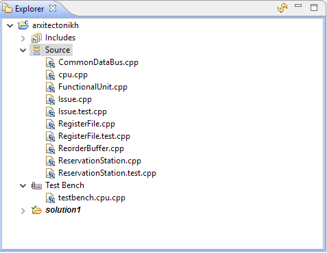

# Project Files

## Main CPU code

The main code of the project lies on 14 files.

| File          | Description  |
| ------------- |---------------|
| global_vars.h | Definition of various global variables |
| cpu.cpp | The main CPU as a function |
| Issue.h | The definition of Issue unit |
| Issue.cpp | The Issue unit's code|
| RegisterFile.h | The definition of Register File unit |
| RegisterFile.cpp | The Register File unit's code |
| FunctionalUnit.h | The definition of the 2 functional units |
| FunctionalUnit.cpp | The 2 functional units' code |
| ReorderBuffer.h | The definition of Reorder Buffer |
| ReorderBuffer.cpp | The Reorder Buffer's code |
| ReservationStation.h | The definition of Reservation Station unit |
| ReservationStation.cpp | The Reservation Station unit's code |
| CommonDataBus.h | The definition of Common Data Bus |
| CommonDataBus.cpp | The Common Data Bus' code |

## Testing and Execution code

For the execution of the CPU and the debugging, 9 more additional file where developed.

| File          | Description  |
| ------------- |---------------|
| testbench.h | Definition of debugging parameters |
| testbench.cpp | Definition of debugging functions |
| testbench.cpu.cpp | Text program execution |
| Issue.test.cpp | Issue unit's test function |
| testbench.Issue.cpp | Execution of Issue unit's test function |
| RegisterFile.test.cpp | RegisterFile unit's test function |
| testbench.RegisterFile.cpp | Execution of RegisterFile unit's test function |
| ReservationStation.test.cpp | Reservation Station test function |
| testbench.ReservationStation.cpp | Execution of Reservation Station test function |

## Inserting the files on an Vivado HLS project

All the `*.cpp` files should be inserted on our projects under the `Source` category except the `testbench.*.cpp` files. To do so, On the `Explorer` panel, we have to right click the `Source` folder and insert each file.

Depending on the test we want to run, we should also include the correct testbench file, one of the `testbench.*.cpp` files. We can insert a testbench file by right clicking the `Test Bench` folder on the `Explorer` panel.
Our project's top level function should change based on the testbench file we want to run.

| Testbench File | Top Function  |
| ------------- |---------------|
| testbench.cpu.cpp | cpu |
| testbench.Issue.cpp | test_Issue |
| testbench.RegisterFile.cpp | test_RegisterFile |
| testbench.ReservationStation.cpp | test_ReservationStation |

The `*.h` files should be added on the project files, on the same directory with the `*.cpp` files, using the file system explorer of our platform.

Our project should look like this

